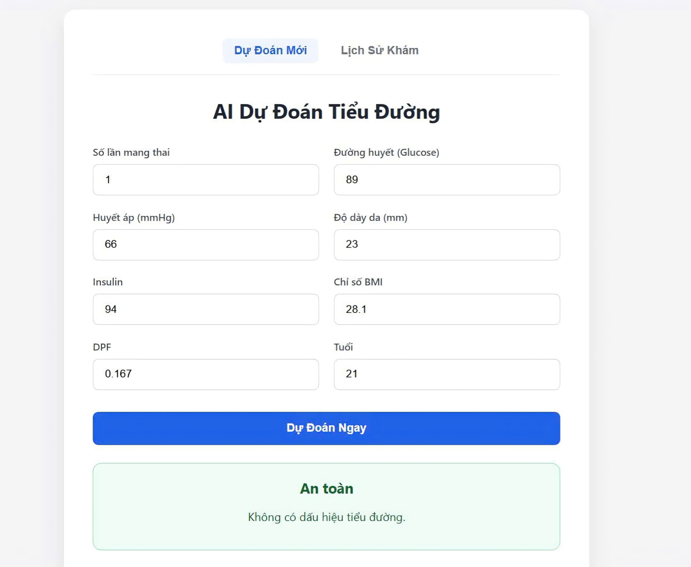
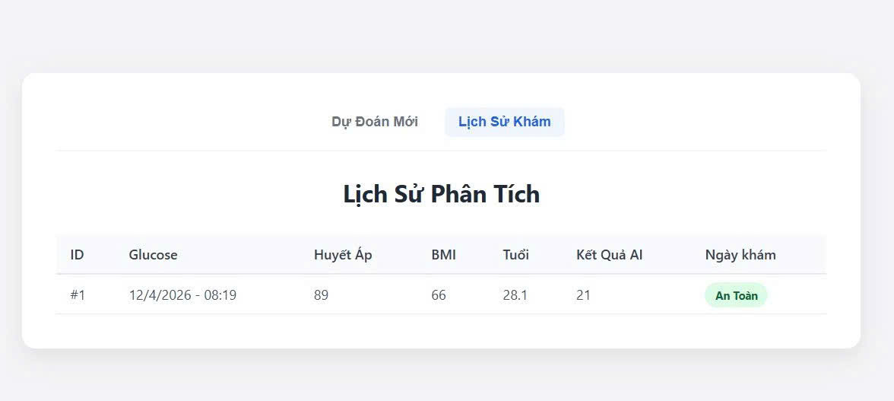

# Đề tài: số 10 - Diabetes-Prediction 

## Thành viên nhóm
|    MSSV     |      Họ và Tên         |     Vai trò    |
|-------------|------------------------|----------------|
| 2351050114  | Nguyễn Thị Ngọc Ngoan  | Full-stack     |
| 2351050206  | Nguyễn Lê Duy Vương    | Full-stack     |
| 2351050211  | Nguyễn Huỳnh Như Ý     | Full-stack     |
| 2351010257  | Võ Hồng Yến            | Full-stack     |   

## 1. Mô tả
### ***Tổng quan về project***
- Trong bối cảnh hiện nay, các bệnh mãn tính như ***tiểu đường (diabetes)*** đang gia tăng nhanh chóng và trở thành một trong những vấn đề y tế toàn cầu. Việc phát hiện sớm nguy cơ mắc bệnh đóng vai trò quan trọng trong việc điều trị và giảm thiểu biến chứng.
- Bài toán trong nghiên cứu này là Xây dựng một mô hình Machine Learning nhằm dự đoán khả năng mắc bệnh tiểu đường dựa trên các chỉ số sinh học (Glucose, BMI, Blood Pressure, Insulin, SkhinThickness) và Thông tin tiền sử ( Age, Pregnancies).
### ***Tổng quan về Dataset:***
- **Dataset:** Kaggle--***Pima Indians Diabetes***__nhằm cung cấp thông tin liên quan đến bệnh tiểu đường.
- **Phân loại**: Classification (phân loại nhị phân)
- **Link:** https://www.kaggle.com/datasets/uciml/pima-indians-diabetes-database
- **Bao gồm:**
  -- Số mẫu: 768
  -- Số features: 8 ( Glucose, BloodPressure, BMI, Insulin, Age, Pregnancies, SkinThickness, DiabetesPedigreeFunction)
  -- Biến mục tiêu: Outcome (0/1)
- **Đặc điểm raw dataset:**
  -- Có giá trị thiếu (được biểu diễn bằng 0)
  -- Một số feature có phân phối lệch
- **Mục tiêu:**
  -- Xây dựng mô hình phân loại có khả năng dự đoán chính xác tình trạng bệnh: Hỗ trợ bác sĩ trong chẩn đoán ban đầu, giảm chi phí xét nghiệm chuyên sâu.
  -- Tối ưu hiệu suất mô hình, đặc biệt giảm thiểu trường hợp bỏ sót bệnh nhân (false negative)
  -- Đánh giá mô hình bằng các chỉ số phù hợp như Recall và F1-score
  -- Triển khai trong hệ thống web app
## 2. Công nghệ:
- Machine learning: Python, Jupyter, Sklearn
- Frontend: ReactJS
- Backend: FastAPI
- Tracking: wandb
## 3. Cài đặt và chạy
#### Yêu cầu
Python 3.11.9
Node.js: v24.14.1
#### Chạy Notebook 
project_analysis.ipynb 
#### Chạy Backend 
cd backend
uvicorn main:app --reload
#### Chạy Frontend 
cd frontend
npm start
#### Truy cập
- Frontend: http://localhost:3000
- Backend: http://127.0.0.1:8000
## 4. Demo
- wandb: https://wandb.ai/yen-h/Diabetes_Prediction?nw=nwuservhy
- Screenshot:
 | 

- **Video**:
[Xem video tại đây](https://drive.google.com/file/d/1XGriCYItsASSgDSFWPC1xK6ot6HgWiSd/view?usp=drive_link)
## 5. Nộp bài
- Báo cáo: report/report.pdf 
- wandb link: wandb_link.txt

